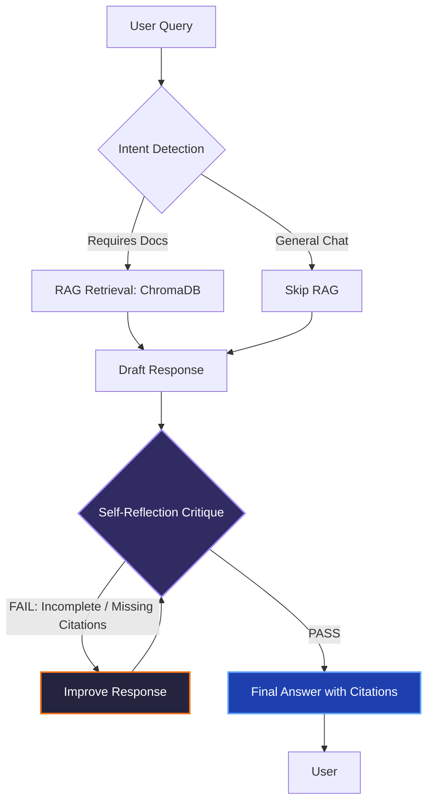

<div align="center">
  
  
  # Agentic AI Research Copilot
  
  **An autonomous, self-reflecting research assistant powered by Gemini API.**  
  *Built for the Google Prompt Wars Hackathon 🏆*

  [](#)
  [](#)
  [](#)
  [](#)
  [](#)

  **[🚀 Try the Live Demo!](https://agentic-copilot-338639382868.us-central1.run.app)**
</div>

---

## 🌟 What is it?

Most RAG (Retrieval-Augmented Generation) systems are simple: they fetch documents and summarize them. **Agentic AI Research Copilot** goes further. 

It doesn't just retrieve context; it **thinks, drafts, critiques itself, and improves its answer** before presenting it to you. Simply upload a PDF, ask a question, and let the agent navigate the context, resolve ambiguities, and ground its answers with exact page citations.

---

## ✨ Features

- **🧠 Agentic Self-ReflectionLoop** — Evaluates and fixes its own mistakes before responding.
- **📄 OCR-Powered PDF Parsing** — Handles both digital and scanned PDFs seamlessly using Tesseract OCR.
- **🛡️ Resilient Architecture** — Uses Google Gemini API as the primary engine, dynamically falling back to local Ollama if the API fails.
- **🎯 Dynamic Routing** — Intent Detection prevents unnecessary DB lookups by classifying queries intelligently.
- **💬 sliding-window Memory** — Remembers the last 3 turns of conversation for deep contextual follow-ups.
- **🚀 Zero Bloat** — Extremely lightweight. No PyTorch, no massive Transformers. Built for edge-speed using Gemini Embeddings.

---

## 📸 Screenshots

*(Replace these placeholders with actual screenshots of your UI)*

| Chat Interface & Reflection Badges | Document Upload & Status |
| :---: | :---: |
|  |  |

---

## 🏛️ Architecture & The Agentic Loop

The core differentiator of this system is the **Reflection Loop**. Instead of blind retrieval, the agent grades its own homework.



### 🗣️ Prompt Engineering Insights
The "Agentic" behavior is triggered via strict prompt chains in `agent.py`:
1. **The Writer:** *"Answer using ONLY the provided context. Cite specific page numbers: [Source: filename (p. X)]"*
2. **The Critic:** *"Evaluate the draft on Accuracy, Completeness, Citations, and Clarity. Reply strictly with VERDICT: PASS/FAIL and CRITIQUE."*
3. **The Editor:** *"Your previous response was reviewed and needs improvement. Fix identified issues based on this CRITIQUE."*

---

## 🛠️ Tech Stack

| Component | Technology Used |
|-----------|-----------------|
| **UI** | Gradio 5+ |
| **Primary LLM** | Google Gemini API (`gemini-2.0-flash`) |
| **Embeddings** | Gemini Embeddings (`models/embedding-001`) |
| **Fallback LLM** | Ollama (`llama3.2:3b` local) |
| **Vector Database** | ChromaDB |
| **PDF Parsing** | PyPDF2 + Tesseract OCR |
| **Cloud Hosting** | Google Cloud Run |

---

## 📂 Project Structure

```text
agentic-ai-research-copilot/
├── app.py              # Gradio UI & Main Entry Point
├── agent.py            # Agentic Loop, Intent Detection & Reflection Logic
├── rag.py              # PDF Ingestion, Chunking, Gemini Embeddings, Retrieval
├── memory.py           # Conversation Memory (Last 3 Turns)
├── utils.py            # Helpers, Config, & Logging
├── requirements.txt    # Lean Dependencies (No torch/transformers)
├── Dockerfile          # Cloud Run Deployment Config
└── test_app.py         # Unit Tests & Sanity Checks
```

---

## 💻 Getting Started (Local Setup)

### 1. Clone the Repo
```bash
git clone https://github.com/rktm0604/agentic-ai-research-copilot.git
cd agentic-ai-research-copilot
```

### 2. Install Dependencies
Make sure you have Tesseract OCR installed on your OS, then run:
```bash
pip install -r requirements.txt
```

### 3. Environment Variables
Create a `.env` file in the root directory (or simply export them):
```env
GEMINI_API_KEY=your_google_gemini_api_key_here
PORT=7860
```

### 4. Run the Copilot
```bash
python app.py
```
Open **http://localhost:7860** in your browser.

---

## ☁️ Deployment (Google Cloud Run)

This project is fully containerized and optimized for Google Cloud Run source-based deployments.

Run this simple command using the `gcloud` CLI:

```bash
gcloud run deploy agentic-copilot \
  --source . \
  --region us-central1 \
  --allow-unauthenticated \
  --memory 2Gi \
  --set-env-vars GEMINI_API_KEY=your_actual_key_here
```

---

<div align="center">
  <p>Built with ❤️ and ☕ for <b>Google Prompt Wars</b>.</p>
</div>
